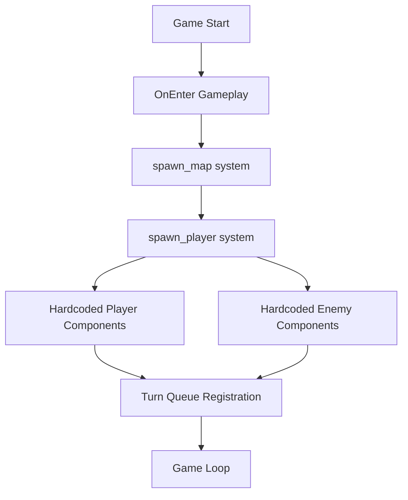
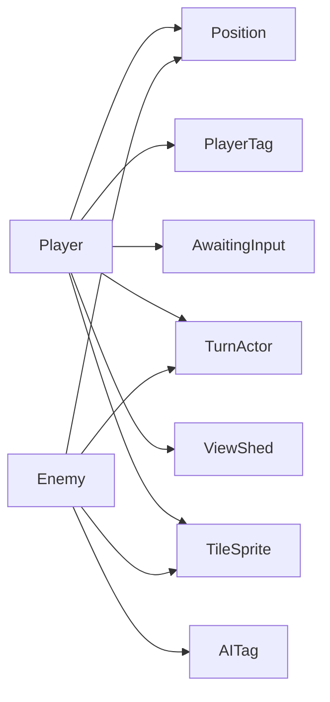
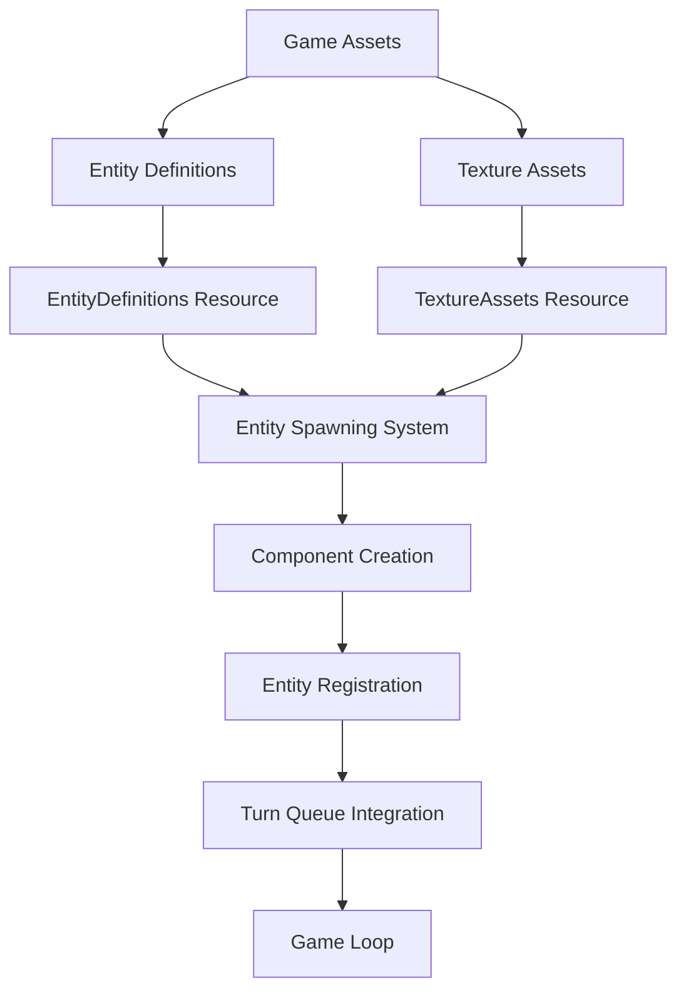
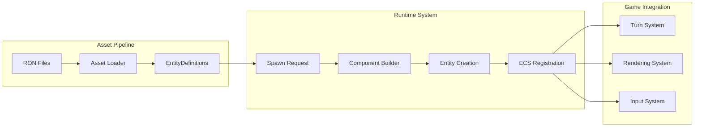
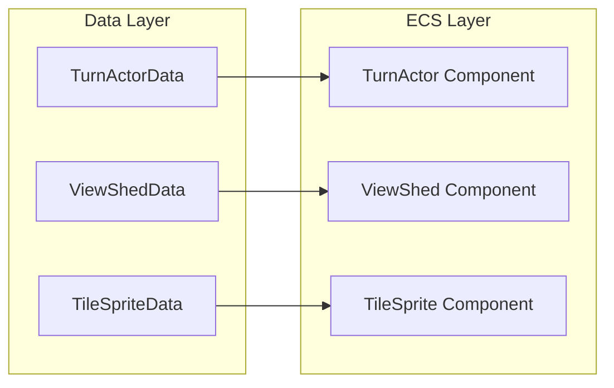
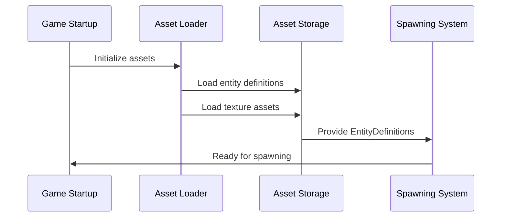
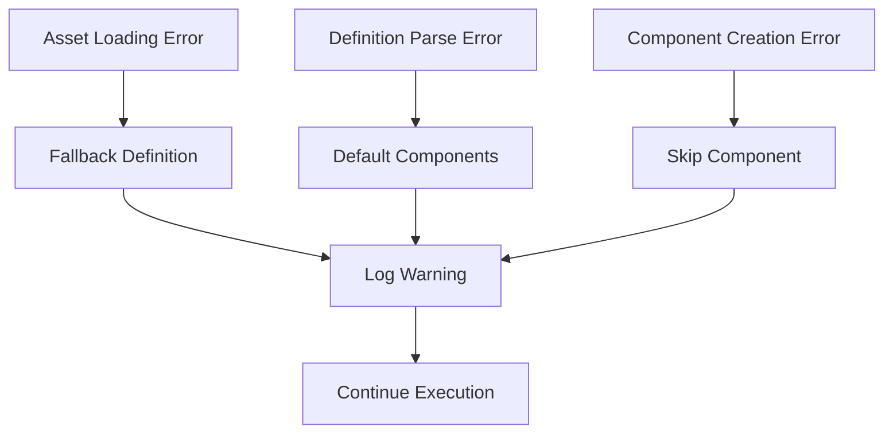
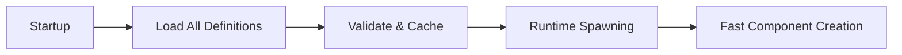
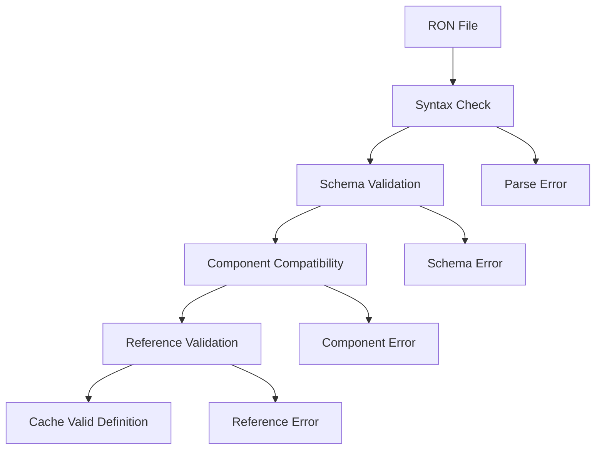
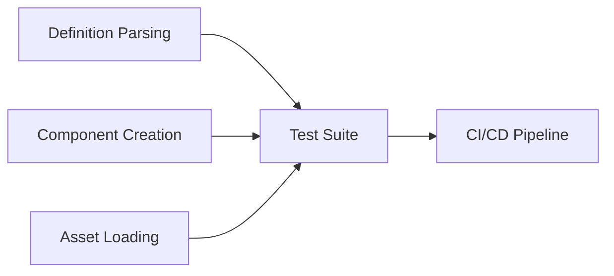

# System Architecture: Data-Driven Entity System

## Overview
This document outlines the architecture for transitioning from hardcoded entity spawning to a flexible, data-driven system using RON files while maintaining seamless integration with the existing Bevy ECS architecture.

## Current System Architecture

### Entity Spawning Flow


### Component Dependencies


## Proposed Architecture

### High-Level System Design


### Data Flow Architecture


## Component Architecture

### Entity Definition Structure
```rust
EntityDefinition
├── Metadata
│   ├── name: String
│   ├── description: Option<String>
│   └── category: EntityCategory
└── Components
    ├── Core Components
    │   ├── turn_actor: Option<TurnActorData>
    │   ├── view_shed: Option<ViewShedData>
    │   └── tile_sprite: Option<TileSpriteData>
    ├── Tag Components
    │   ├── is_player: Option<bool>
    │   ├── is_ai: Option<bool>
    │   └── is_item: Option<bool>
    └── Gameplay Properties
        ├── spawn_weight: Option<f32>
        ├── level_range: Option<(u32, u32)>
        └── spawn_conditions: Option<SpawnConditions>
```

### Component Data Mapping


## Asset Management Architecture

### Asset Loading Pipeline


### Directory Structure
```
src/
├── model/
│   ├── entities/           # New: Entity definition system
│   │   ├── mod.rs
│   │   ├── definition.rs   # EntityDefinition structs
│   │   ├── components.rs   # Component data structs
│   │   ├── loader.rs       # Asset loading logic
│   │   └── spawner.rs      # Data-driven spawning logic
│   ├── components/         # Existing ECS components
│   ├── resources/          # Existing resources
│   └── systems/           # Existing systems (modified)
│       └── spawner.rs     # Refactored spawning system
└── assets/
    └── entities/          # New: Entity definition files
        ├── player.ron
        ├── enemies/
        │   ├── whale.ron
        │   └── basic_enemy.ron
        └── items/
```

## System Integration Points

### 1. Asset Loading Integration
```rust
// Existing pattern in textures.ron
({
    "entity_definitions": Folder(
        path: "entities",
    ),
    "urizen_textures": Folder(
        path: "textures/urizen",
    ),
})
```

### 2. ECS Component Registration
```rust
// In model/mod.rs - extend existing registrations
app.register_type::<EntityDefinition>()
   .register_type::<EntityComponents>()
   .register_type::<TurnActorData>()
   .register_type::<ViewShedData>()
   .register_type::<TileSpriteData>();
```

### 3. System Scheduling
```rust
// In view/screens/gameplay.rs - modify existing setup
app.add_systems(
    OnEnter(ScreenState::Gameplay),
    (
        spawn_map,
        spawn_entities_from_data,  // New data-driven system
    ).chain().in_set(GameplaySystemSet::Initialization),
);
```

## Error Handling Architecture

### Error Propagation


### Recovery Mechanisms
1. **Asset Loading Failures**: Use embedded default definitions
2. **Parse Errors**: Skip malformed components, use defaults
3. **Component Conflicts**: Prefer data definition over hardcoded
4. **Missing Dependencies**: Graceful component skipping

## Performance Architecture

### Loading Strategy


### Memory Management
- **Shared Data**: Entity definitions shared across instances
- **Component Pooling**: Reuse component data objects
- **Cache Strategy**: Pre-compiled component bundles
- **Hot Reloading**: Development-time only asset watching

## Security & Validation

### Asset Validation Pipeline


### Runtime Safety
- **Type Safety**: Strong typing through serde
- **Component Validation**: Ensure ECS compatibility
- **Reference Safety**: Validate asset references
- **Resource Limits**: Prevent resource exhaustion

## Extension Points

### 1. Custom Components
```rust
// Plugin architecture for new component types
trait ComponentData: Send + Sync + 'static {
    type Component: Component;
    fn create_component(&self) -> Self::Component;
}
```

### 2. Spawn Conditions
```rust
// Extensible spawn condition system
trait SpawnCondition: Send + Sync {
    fn can_spawn(&self, context: &SpawnContext) -> bool;
}
```

### 3. Entity Templates
```rust
// Template inheritance system
struct EntityTemplate {
    base: Option<String>,  // Reference to parent template
    overrides: EntityComponents,
}
```

## Migration Strategy

### Phase 1: Foundation (Parallel Development)
- Implement entity definition system alongside existing
- Add asset loading without affecting current spawning
- Create basic player/enemy RON files

### Phase 2: Integration (Gradual Replacement)
- Replace player spawning with data-driven approach
- Migrate enemy spawning one type at a time
- Maintain feature flags for rollback

### Phase 3: Enhancement (Full Data-Driven)
- Remove hardcoded spawning code
- Add advanced features (templates, conditions)
- Optimize performance and add development tools

### Rollback Strategy
- Feature flags to disable data-driven spawning
- Fallback to hardcoded systems on asset errors
- Maintain compatibility layers during transition

## Testing Architecture

### Unit Testing Strategy


### Integration Testing
- Full spawning pipeline tests
- Performance benchmarks vs current system
- Memory usage validation
- Hot reloading verification

### Development Tools
- RON syntax highlighting and validation
- Entity definition live preview
- Performance profiling tools
- Asset dependency visualization
